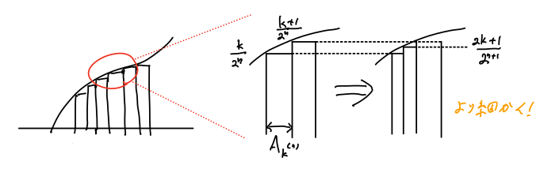
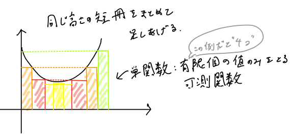
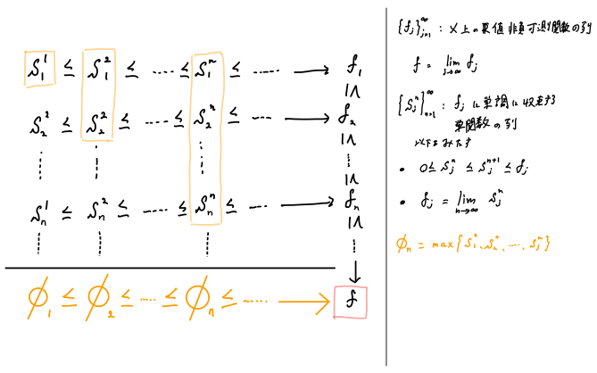
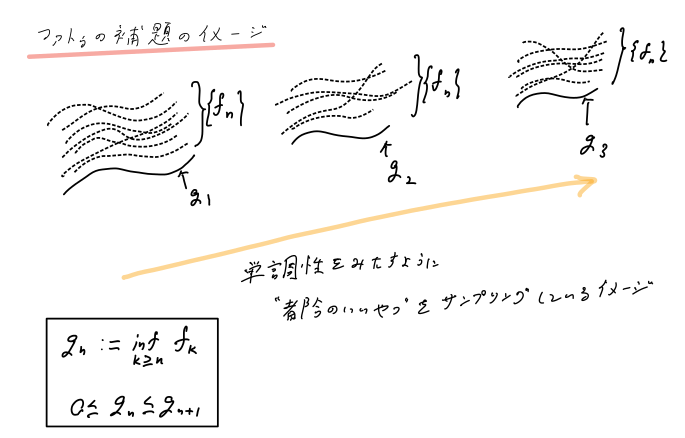

# ルベーグ積分の基本のキ
本スライドは「測度論について私が理解したこと」の続きである。

---
# 記号の約束
- 整数全体の集合を $\mathbb{Z}$ 、有理数全体の集合を $\mathbb{Q}$ 、実数全体の集合を $\mathbb{R}$ 、複素数全体の集合を $\mathbb{C}$ とする。
- **[Def]** を定義、**[Thm]** を定理、**[Prf]** を証明、**[Lem]** を補題、**[N.B.]** を注意点とする。
- 本スライドは基本的に実数値関数を考える。

---
# 測度空間
集合 $X$、可測集合 $\mathcal{M}$ 、測度 $\mu$ の組： $(X, \mathcal{M},\mu)$ を測度空間という。

---
# 可測関数
一般の集合の「いい感じの部分集合」に「いい感じの値」が定められるなら、
一般の集合上の関数に対して、積分を考えられるんじゃないか？

準備： 記号 $\overline{\mathbb{R}}$ を $\overline{\mathbb{R}}=\mathbb{R}\cup \{-\infty,\infty\}$ とおく。

---
# 可測関数
**[Def]**
$X$ 上の関数 $f:X \rightarrow \overline{\mathbb{R}}$ が任意の実数 $a$ について以下の条件をみたすとき、
$f$ を**可測関数**という。
$$ \{x \in X \mid a < f(x) \leq \infty \} \in \mathcal{M} $$

上式を
$$ f^{-1}((a,\infty]) \in \mathcal{M} $$
と表すこともある。

---
# 可測関数
$X$ 上の $\overline{\mathbb{R}}$ 値関数 $f$ が可測関数であれば、任意の実数 $a$ に対して次が従う。
$$ \begin{align*}
f^{-1}([-\infty, a)) &= \left(f^{-1}((a,\infty] ) \right)^c \in \mathcal{M} \\
f^{-1}([a,\infty]) &= \bigcap^\infty_{j=1}\left(f^{-1} \left( \Big(a-\frac{1}{j},\ \infty \Big] \right) \right) \in \mathcal{M} \\
f^{-1}(\{a\}) &= f^{-1} \left( [-\infty,a] \right) \cap f^{-1}\left( [a,\infty] \right)  \in \mathcal{M} \\
f^{-1} ([-\infty, \infty]) &= \bigcup^\infty_{j=1} f^{-1} \big( [-\infty, j) \big) \in \mathcal{M} \\
f^{-1} (\{ \infty \}) &= \left( f^{-1} \big([-\infty, \infty) \big) \right)^c \in \mathcal{M} \\
f^{-1} ((-\infty, \infty]) &= \bigcup^\infty_{j=1} f^{-1} \big( (-j, \infty] \big) \in \mathcal{M} \\
f^{-1} (\{-\infty\}) &= \left( f^{-1} \Big( (-\infty, \infty] \Big) \right)^c \in \mathcal{M}
\end{align*} $$

---
# 可測関数
また、 $a<b$ をみたす任意の実数 $a,b$ に対して、次が従う。
$$ \begin{align*}
f^{-1} \big( (a,b] \big) &= f^{-1} \big( (a,\infty] \big) \cap f^{-1} \big( [-\infty,b] \big) \in \mathcal{M} \\
f^{-1} \big( [a,b) \big) &= f^{-1} \big( [a,\infty] \big) \cap f^{-1} \big( [-\infty, b) \big) \in \mathcal{M}
\end{align*} $$

**[N.B.]**
可測集合の性質から明らか。

---
# 可測関数の上限、下限、上極限、下極限
可算個の $X$ 上の可測関数 $f_j \ (j=1,2,\dots)$ について、次の4つの関数 $g_1, g_2, g_3, g_4$ はいずれも可測関数である。
$$ \begin{align*}
g_1(x) &= \sup_{j\in \mathbb{N}} f_j(x) \\
g_2(x) &= \inf_{j\in \mathbb{N}} f_j(x) \\
g_3(x) &= \limsup_{j\rightarrow \infty} f_j(x) \\
g_4(x) &= \liminf_{j\rightarrow \infty} f_j(x)
\end{align*} $$
さらに、もし $f(x) = \lim_{j\rightarrow \infty} f_j(x)$ がすべての $x\in X$ に対して存在すれば、 $f$ も可測関数である。

**[N.B.]**
$X$ 上に引き戻したときに、その集合は可測かということを考えればわかる。

---
# 単関数
**[Def]**
関数 $s:X \rightarrow \mathbb{R}$ が有限個の値のみをとる可測関数であるとき、 $s$ を単関数という。
すなわち、ある互いに素な $A_1,\dots, A_N \in \mathcal{M}$ と実数 $a_1,\dots,a_N$ が存在し、
$$ X = A_1\cup\cdots\cup A_N \quad \text{かつ}  \quad s=\sum^N_{i=1}a_i \chi_{A_i} $$
と表されることをいう。ここで、 $\{ a_i\}^N_{i=1}$ は重複を許す。
$\chi_A$ は以下で定まる集合 $A$ の特性関数である。 $X$ の部分集合 $A$ に対して、
$$ \chi_A(x) =
\begin{cases}
1 \quad (x \in A) \\
0 \quad (x \in A^c)
\end{cases} $$

---
# 単関数列と可測関数
**[Thm]**
関数 $f: X \rightarrow \overline{\mathbb{R}}$ を $0 \le f(x) \le \infty$ をみたす $X$ 上の可測関数とする。
次の条件をみたす単関数の列 $\{s_j\}_{j\in \mathbb{N}}$ が存在する。
1. すべての $x$ に対して、 $0\le s_1(x) \le s_2(x) \le \cdots \rightarrow f(x)$
2. 各 $s_j$ は有界かつ $\mu \left( \{x \in X\ \middle|\ s_j(x) \not ={0}\} \right) < \infty$

---
# 単関数列と可測関数
**[Prf]**
単関数列 $\{s_j\}_{j\in\mathbb{N}}$ を構成する。 $j=1,2,\dots$ に対して $s_j(x)$ を次のように定義する
$$ s_j(x) = \begin{cases}
2^{-j}(k-1)  &\left( |x| \le j \ \text{かつ}\  k=1,2,\dots,\ j\cdot 2^j \ \text{について} \ 2^{-j}(k-1)\le f(x) < k\cdot2^{-j} \right) \\
j  &\left( |x| \le j \ \text{かつ} \ f(x) \ge j \right) \\
0  &\left( |x| > j \right)
\end{cases} $$
2 がみたされることはすぐにわかる。1 を示す。すべての $x$ と $j$ に対して、
$$ 0 \le s_j(x) \le s_{j+1}(x) \le f(x) $$
である。そして、 $|x| \le j$ かつ $f(x) < j$ のとき、
$$ 0 \le f(x) -s_j(x) \le 2^{-j} $$
である。よって、 $f(x)<\infty$ のときは、 $s_j(x)\rightarrow f(x)$ となる。
$f(x)=\infty$ のときは $s_j(x)=j \rightarrow \infty$ だから 1 が示された。

---
# 単関数列のイメージ

---
# 単関数の積分
**[Def]**
非負単関数 $s:X \rightarrow [0,\infty)$ が実数 $a_i\geq0$ と互いに素な可測集合
$A_i\in\mathcal{M} \ (1 \leq i \leq N)$ を用いて、次のように表されるとする。
$$ X = \bigcup^N_{i=1}A_i, \quad s = \sum^N_{i=1}a_i \chi_{A_i} $$
$s$ の**積分**を
$$ \int s d\mu = \sum^N_{i=1}a_i \mu(A_i) \in [0, \infty] $$
と定義する。

---
# ルベーグ積分
**[Def]** 非負可測関数のルベーグ積分
$f:X\rightarrow [0,\infty]$ を非負可測関数とする。 $f$ のルベーグ積分を次のように定義する。
$$ \int f d\mu = \sup_{0 \leq s \leq f} \int s d\mu \ \in [0, \infty] $$
ここで、 $\sup_{0 \leq s \leq f}$ は任意の元 $x \in X$ に対し $0 \leq s(x) \leq f(x)$ をみたす全ての非負単関数 $s$ にわたって $\sup$ をとることを意味する。

---
# ルベーグ積分のイメージ

---
# ルベーグ積分
**[Def]** 一般の可測関数のルベーグ積分
$f:X \rightarrow \overline{\mathbb{R}}$ を可測関数とする。
$$ f^+ = \max(f, 0), \quad f^- = \max(-f, 0) $$
と定義する。このとき、次を $f$ の**ルベーグ積分**という。
$$ \int f d\mu = \int f^+ d\mu - \int f^- d\mu $$

---
# ルベーグ積分
「 $f$ が積分確定」とは次の条件が成り立つことをいう。
$$ \int f^+ d\mu  < \infty \quad または \quad \int f^- d\mu < \infty $$
「 $f$ がルベーグ可積分」とは次の条件が成り立つことをいう。
$$ \int f^+ d\mu  < \infty \quad かつ \quad \int f^- d\mu < \infty $$

---
# ほとんど至るところ
**[Def]**
命題 $P(x)$ を、可測集合 $A$ の元 $x$ に対する命題とする。 $P(x)$ が測度0の集合を除いて成立しているとき、**ほとんど至るところ** $P(x)$ が成り立つという。

ルベーグ積分ではほとんど至るところに、「ほとんど至るところ」という言葉がでてくるので、 略して、a.e. (almost everywhere) とつける場合もある。

---
# ルベーグ積分の線形性
**[Def]**
$f, g :\mathbb{R} \to \overline{\mathbb{R}}$ をルベーグ可積分関数とするとき、次が成り立つ。
1. 負でない実数 $\alpha, \beta$ に対して、 $\int (\alpha f+ \beta g) d\mu = \alpha \int f d\mu + \beta \int g d\mu$
2. ほとんど至るところ $f \le g$ のとき、 $\int f d\mu \le \int g d\mu$

[Prf]
ルベーグ積分の定義（単関数の積分の $\sup$ ）にまで戻って考えればよい。

---
# ルベーグ積分に関する諸々の定理
以下の3つを示す。
- 単調収束定理
- ファトゥの補題
- ルベーグの優収束定理

**[N.B.]**
以降、集合 $X$ 上の関数 $f$ と関数 $g$ の大小を論じるときに、
任意の元 $x \in X$ において $f(x) \le g(x)$ が成り立つことを $f\le g$ と表す。

---
# ルベーグ積分に関する諸々の定理

3つの定理の出発点は、
- 非負可測関数 $f$ に対し、次の条件をみたす非負単関数の列 $\{ s_n \}_{n\in \mathbb{N}}$ が存在するということ
    - $0 \leq s_1 \leq s_2 \leq \cdots$
    - $f = \lim_{n\to \infty} s_n$ (各点収束)

- 上記の非負単関数の列は次もみたす。
$$ \int f d\mu = \lim_{n\to \infty} \int s_n d\mu $$

---
# 単調収束定理
**[Thm]**
$X$ 上の $\overline{\mathbb{R}}$ 値非負可測関数の列 $\{f_j\}^\infty_{j=1}$ が以下の条件をみたすとする。
1. ほとんど至るところ $f_1 \leq f_2 \leq \cdots \leq f_j \leq \cdots$ 。
2. ほとんど至るところ $f=\lim_{j\to \infty}f_j$ となる $f$ が存在する。

このとき、 $f$ は $X$ 上の $\overline{\mathbb{R}}$ 値非負可測関数であり、
$$ \int_X f d\mu = \lim_{j\to\infty}\int_X f_j d\mu $$
が成り立つ。（ $\infty=\infty$ も許す）

---
# 単調収束定理
**[Prf 1]**
（可算個の）零集合の和集合は零集合なので、「ほとんど至るところ」を除いて定理を示せば十分である。（ $f_1$ の零集合上の値、 $f_2$ の零集合上の値…を無視していく）
2 の条件より、（ $\infty$ も許して） $\lim_{j\rightarrow \infty} f_j(x) = f(x)$ は常に存在する。 可測関数の上限、下限、上極限、下極限のスライドより、 $f$ は可測関数。
1 の条件より、 $0\leq f_j \leq f$ なので
$$ \int_X f_j d\mu \leq \int_X f d\mu $$
が全ての $j$ について成立する。上式より、
$$ \limsup_{j\rightarrow\infty} \int_X f_j d\mu \leq \int_X f d\mu $$
がわかる。

---
# 単調収束定理
**[Prf 2]**
ここで、次を示す。
$$ \liminf_{j\rightarrow\infty} \int_X f_j d\mu \geq \int_X fd\mu $$
上式が示されれば、 $\lim_{j\rightarrow\infty} \int _X f_j d\mu$ が存在して、定理が示される。
ここで（天下り的だが）、 $\alpha \in (0, 1)$ と $0\le \phi \le f$ となる単関数 $\phi$ を任意にとる。
$$ E_j = \left\{ x\in X \ \middle| \ f_j(x) > \alpha \phi(x) \right\} = \left\{ x\in X\ \middle| \ f_j(x) -\alpha \phi(x) >0 \right\} $$
とおく。 $f_j-\alpha\phi$ （可測関数 $-$ 可測関数の形）は可測なので、 $E_j\in \mathcal{M}$ であり、
$$ E_j \subset E_{j+1}, \quad \bigcup^\infty_{j=1}E_j =X $$
という性質を持つ。

---
# 単調収束定理
**[Prf 3]**
実際、 $f_j \leq f_{j+1}$ より $E_j \subset E_{j+1}$ である。
各 $x\in X$ に対し $f(x) \geq \phi(x) > \alpha \phi(x)$ であり、 $\lim_{j\rightarrow\infty}f_j(x) = f(x)$ なので、 $f_j(x) > \alpha \phi(x)$ なる番号 $j$ が存在する。したがって、その番号 $j$ 以降では各 $x\in X$ に対し $x\in E_j$ 。よって、 $\bigcup^\infty_{j=1}E_j = X$ を得る。
ここで、 $A \in \mathcal{M}$ に対して、 $\nu(A) = \int_A \phi d\mu$ とおく。 $\nu$ は $\mathcal{M}$ 上の測度となる。（←要確認）
$f_j \ge \chi_{E_j}f_j \ge \alpha \chi_{E_j}\phi$ なので、
$$ \int_X f_j d\mu \ge \int_X \chi_{E_j}f_jd\mu \ge \int_X \alpha \chi_{E_j}\phi d\mu = \alpha \int_{E_j}\phi d\mu = \alpha \nu(E_j) $$

---
# 単調収束定理
**[Prf 4]**
最左辺と最右辺の下極限をとる。ここで、 $\nu$ は $\mathcal{M}$ 上の測度なので、
$$ \liminf_{j\rightarrow \infty}\int_X f_jd\mu \ge \liminf_{j\rightarrow\infty} \alpha \nu (E_j) = \alpha \nu(\bigcup^\infty_{j=1}E_j) = \alpha \nu(X) = \alpha \int_X \phi d\mu $$
$\alpha \in(0,1)$ は任意なので $\alpha \rightarrow 1$ として、
$$ \int_X\phi d\mu \le \liminf_{j\rightarrow\infty} \int_X f_j d\mu $$
を得る。

---
# 単調収束定理
**[Prf 5]**
$\phi$ は $0 \le \phi \le f$ をみたす任意の単関数なので、左辺の上限をとると、
$$ \int_X f d\mu \le \liminf_{j\rightarrow\infty} \int_X f_j d\mu $$
したがって、
$$ \limsup_{j\rightarrow\infty} \int_X f_j d\mu \le \int_X fd\mu \ \text{と} \ \int_X f d\mu \le \liminf_{j\rightarrow\infty} \int_X f_j d\mu $$
が示されたので、
$$ \int_X f d\mu = \lim_{j\to\infty}\int_X f_j d\mu $$
が成り立つ。

---
# 単調収束定理の補題
**[Lem]**
$A \in \mathcal{M}$ に対して、 $\nu(A) = \int_A \phi d\mu$ とおく。
$\nu$ は $\mathcal{M}$ 上の測度となる。

**[Prf]**
$\{ A_k\}^\infty_{k=1}$ を $\mathcal{M}$ の互いに素な集合列とする。 $A = \bigcup^\infty_{k=1} A_k$ とする。
$$ \phi(x) = \sum^N_{j=1} a_j \chi_{E_j} (x) \quad (a_j>0,\ j=1,\dots,N) $$
とする。

---
# 単調収束定理の補題
**[Prf]**
単関数の積分の定義より、
$$ \nu(A) = \sum^N_{j=1} a_j \mu(A\cap E_j), \quad \nu(A_k) =\sum^N_{j=1} a_j \mu(A_k\cap E_j) $$
$A\cap E_j = \bigcup^\infty_{k=1}(A_k \cap E_j)$ であり、右辺は互いに交わらない $\mathcal{M}$ の集合列。
$\mu$ は測度なので、
$$ \mu(A\cap E_j) = \sum^\infty_{k=1} \mu(A_k \cap E_j) $$

---
# 単調収束定理の補題
**[Prf]**
したがって、
$$ \nu(A) = \sum^N_{j=1} a_j \mu(A\cap E_j) = \sum^\infty_{k=1} \sum^\infty_{j=1} a_j \mu(A_k \cap E_j) = \sum^\infty_{k=1} \nu(A_k) $$
以上より、 $\nu$ は $\mathcal{M}$ 上の測度である。
$\nu(\varnothing) =0$ は自明。

---
# 単調収束定理の別証明

---
# 単調収束定理の別証明
**[Prf 1]**
可測関数 $f_j$ に単調に収束する 単関数の列 $\{ s^n_j\}^\infty_{n=1}$ を考える。
$\{ s^n_j\}^\infty_{n=1}$ から 単関数 $\phi_n = \max(s^n_1, s^n_2,\dots, s^n_n)$ の列 $\{\phi_n\}^\infty_{n=1}$ を構成する。

単関数の列 $\{\phi_n\}^\infty_{n=1}$ が $f$ に収束することを目指す。
まず、 $\phi_n \le f_n \le f$ より $n \rightarrow \infty$ とすれば、
$$ \lim_{n\rightarrow\infty} \phi_n \le f $$
を得る。
次に、 $j<n$ としながら $j$ を固定する。 $\phi_n$ の定め方より $\phi_n$ は単調に増加するので、
$$ s^n_j \le \phi_n \le \lim_{n\rightarrow\infty}\phi_n $$
となる。 $n\rightarrow\infty$ として $f_j \le \lim_{n\rightarrow\infty}\phi_n$ を得る。

---
# 単調収束定理の別証明
**[Prf 2]**
$j$ は任意だから $j\rightarrow\infty$ として、 $f\le \lim_{n\rightarrow\infty}\phi_n$ を得る。
よって、 $f= \lim_{n\rightarrow\infty}\phi_n$ となるので、
$$ \int fd\mu = \int \lim_{n\rightarrow\infty} \phi_n d\mu $$
を得る。 $\phi_n$ は単関数なので、
$$ \int \lim_{n\rightarrow\infty} \phi_n d\mu = \lim_{n\rightarrow\infty} \int \phi_n d\mu $$
また、 $\phi_n \le f_j \le f$ より
$$ \lim_{n\rightarrow\infty} \int \phi_n d\mu \le \lim_{n\rightarrow\infty} \int f_j d\mu \le \int f d\mu $$
上記の不等式を合わせると定理が示された。

---
# ファトゥの補題
**[Thm]**
$X$ 上の $\overline{\mathbb{R}}$ 値非負可測関数の列 $\{f_j\}^\infty_{j=1}$ に対し
$$ \int_X \liminf_{j\to\infty} f_j d\mu \leq \liminf_{j\to\infty}\int_X f_j d\mu $$
が成り立つ。

---
# ファトゥの補題
**[Prf 1]**
$g_n = \inf_{k \ge n} f_k$ とする。 $0 \le g_n \le g_{n+1}$ である。可測関数の上限、下限、上極限、下極限のスライドより $g_n$ は可測関数。両辺の極限をとると、
$$ \lim_{n\rightarrow \infty} g_n = \lim_{n \rightarrow \infty}\left(  \inf_{k\ge n} f_k\right) = \liminf_{n\rightarrow\infty}f_n $$
上記と単調収束定理から
$$\lim_{n\rightarrow\infty} \int g_n d\mu = \int\left( \lim_{n\rightarrow\infty}g_n \right) d\mu = \int \left( \liminf_{n\rightarrow \infty}  f_n\right) d\mu \qquad \tag{1}$$
一方、 $g_n \le f_n$ より
$$ \liminf_{n\rightarrow \infty} \int g_n d\mu \le \liminf_{n\rightarrow \infty} \int f_n d\mu \qquad \tag{2} $$

---
# ファトゥの補題
**[Prf 2]**
$\left\{ \int g_n d\mu \right\}_{n\in \mathbb{N}}$ は単調非減少列だから、
$$ \liminf_{n\rightarrow\infty} \int g_n d\mu = \lim_{n\rightarrow\infty} \int g_n d\mu = \limsup_{n\rightarrow \infty} \int g_n d\mu \qquad \tag{3} $$
が成り立つ。
$(1),\ (2),\ (3)$ よりファトゥの補題が成り立つ。

---
# ファトゥの補題のイメージ

---
# ルベーグの優収束定理
**[Thm]**
$X$ 上の $\overline{\mathbb{R}}$ 値可測関数の列 $\{f_j\}^\infty_{j=1}$ が次の条件をみたすとする。
1. $f=\lim_{j\to \infty}f_j\; \text{a.e.}$ となる $f$ が存在する
2. ある $X$ 上の**非負可積分**関数 $\Phi$ が存在し、任意の自然数 $j$ に対して $|f_j| \leq \Phi \; \text{a.e.}$

このとき、 $f_j,\ f$ は $X$ 上の $\overline{\mathbb{R}}$ 値**可積分**関数となり、
$$ \lim_{j\to\infty}\int_X f_j d\mu = \int_X f d\mu $$
が成り立つ。（ $\infty=\infty$ も許す）

---
# ルベーグ二乗可積分な関数の集合
**[Def]** $L^2$ 空間
$(X, \mathcal{M}, \mu)$ を測度空間とする。
$$ \int_X |f(x)|^2 d\mu < \infty $$
をみたす $X$ 上の可測関数の集合を $L^2$ 空間という。
$L^2$ 空間の元 $f$ のノルムを
$$ \| f \|_2 = \left( \int_X |f(x)|^2 d\mu \right)^{\frac{1}{2}} < \infty $$
とおく。これを $L^2$ ノルムという。
$L^2$ 空間は $L^2$ ノルムに関してノルム空間となっている。

---
# ルベーグ二乗可積分な関数の集合
**[Def]** 続き
$L^2$ 空間の任意の2つの元 $f,g$ に対して
$$ \langle f, g \rangle = \int_X f(x)\overline{g(x)}d\mu $$
とおけば、 $\langle f, g \rangle$ は $L^2$ 空間の内積となる。
この内積に関して、 $L^2$ 空間はヒルベルト空間となる。

---
# リーマン積分とルベーグ積分
実数 $a,b\ (a<b)$ に対し、関数 $f(x):[a,b] \rightarrow \mathbb{R}$ のリーマン積分とルベーグ積分の関係を考える。

**[Thm]**
区間 $[a,b]$ 上の有界関数 $f$ がリーマン可積分であるとき、ルベーグ可積分であり、
$$ \text{(リーマン積分)}\quad \int^b_a f(x) dx = \int_{[a,b]} f d\mu \quad \text{(ルベーグ積分)} $$
が成り立つ。以上より、ルベーグ積分はリーマン積分の拡張と考えられる。

[N.B.]
リーマン積分の定義に戻って、その要素ひとつひとつがルベーグ積分の「範疇」に入っていることを確かめていく。

---
# リーマン積分とルベーグ積分
**[Prf 1]**
$x\notin [a,b]$ に対し、 $f(x)=0$ と定義し、 $f$ を $\mathbb{R}$ 上の関数として拡張して考える。
$f(x)$ は有界なので、ある実数 $M>0$ が存在し、 $-M\le f(x) \le M$ が成り立つ。
区間 $[a,b]$ の分割 $\triangle = \{(a=)x_0,x_1,\dots,x_N(=b)\}$ を考える。
$0\le k \le N$ に対し、
$$m_k = \inf\left\{f(x) \mid x_k \le x \le x_{k+1}\right\},\quad M_k=\sup\left\{f(x) \mid x_k\le x\le x_{k+1}\right\}$$
とおき、
$$s^\prime(f,\triangle)= \sum^{N-1}_{k=0}m_k(x_{k+1}-x_k),\quad S(f,\triangle) = \sum^{N-1}_{k=0}M_k(x_{k+1}-x_k)$$
とおく。 $f$ はリーマン可積分なので、 $|\triangle| = \max_{0\le k <N} (x_{k+1}-x_k) \rightarrow 0$ のとき、 $s^\prime (f,\triangle)$ と $S(f,\triangle)$ はともにリーマン積分 $\int^b_af(x)dx$ に収束する。

---
# リーマン積分とルベーグ積分
**[Prf 2]**
一方、次の単関数を考える。
$$t_\triangle = \sum^{N-1}_{k=0}m_k x_{[x_k,\ x_{k+1})}, \quad T_\triangle=\sum^{N-1}_{k=0}M_kx_{[x_k,\ x_{k+1})}$$
これらの単関数は次の関係をみたす。
$$ \int t_\triangle d\mu = \sum^{N-1}_{k=0} m_k \mu([x_k,\ x_{k+1})) = s^\prime (f,\triangle) \qquad \tag{1}$$
$$\int T_\triangle d\mu = \sum^{N-1}_{k=0} M_k \mu([x_k,\ x_{k+1})) = S (f,\triangle) \qquad \tag{2}$$

---
# リーマン積分とルベーグ積分
**[Prf 3]**
ここで、 $n=1,2,\dots$ に対し、区間 $[a,b]$ を $2^n$ 等分することを考える。
$$\triangle_n = \left\{ a+\frac{b-a}{2^n} k \right\}^{2^n}_{k=0}$$
とおくと、 $\triangle_n \subset \triangle_{n+1}$ であり、 $|\triangle_n|=\frac{|b-a|}{2^n}\rightarrow0\ (n\rightarrow \infty)$ である。

次に、
$$t_n = t_{\triangle_n},\quad T_n = T_{\triangle_n}$$
とおくと、すべての $n\in \mathbb{N}$ についてほとんど至るところ
$$-M \le t_n \le t_{n+1} \le f \le T_{n+1} \le T_n \le M$$
が成り立つ。

---
# リーマン積分とルベーグ積分
**[Prf 4]**
$\{t_n\}_{n=1}^\infty, \ \{T_n\}_{n=1}^\infty$ は有界かつ単調な関数列なので、ほとんど至るところで
$$g = \lim_{n\rightarrow \infty}t_n, \quad G = \lim_{n\rightarrow\infty}T_n$$
をみたす可測関数 $g,\ G$ が存在し、 $g \le f \le G\ \  \text{a.e.}$ をみたす。

ここで $M\chi_{[a,b]}$ を考えると、これは非負可積分関数であり、
$$|t_n|\le M\chi_{[a,b]},\quad |T_n|\le M\chi_{[a,b]}$$
をみたす。（ここで、「 $f$ が有界である」という条件が要る。）

---
# リーマン積分とルベーグ積分
**[Prf 5]**
したがって、ルベーグの優収束定理より、 $g$ と $G$ は可積分であり、
$$\int g d\mu = \lim_{n\rightarrow\infty} \int t_n d\mu = \lim_{n\rightarrow\infty}\int s^\prime(f,\triangle_n)$$
$$\int G d\mu = \lim_{n\rightarrow\infty} \int T_n d\mu = \lim_{n\rightarrow\infty}\int S(f,\triangle_n)$$
が成り立つ。(右の "=" は[Prf 2] の(1)と(2))

$f$ はリーマン可積分なので、
$$\lim_{n\rightarrow\infty}s^\prime(f,\triangle_n) = \lim_{n\rightarrow\infty}S(f,\triangle_n) = \int^b_a f(x) dx$$
である。

---
# リーマン積分とルベーグ積分
**[Prf 6]**
ゆえに、
$$\int g d\mu = \int G d\mu = \int^b_a f(x)dx$$
である。

一方、 $g \le f \le G\ \ \text{a.e.}$ より $G-g\ge 0\ \ \text{a.e.}$ だが、
$$0 \le \int (G-g)d\mu = \int G d\mu - \int gd\mu = 0$$
なので、 $g=G\ \ \text{a.e.}$ でなければならない。

---
# リーマン積分とルベーグ積分
**[Prf 7]**

以上より、 $g=f=G\ \text{a.e.}$ であり、（ $g$ と $G$ は $M\chi_{[a,b]}$ で上から押さえつけられており） $f$ はルベーグ可積分かつ
$$\int_{[a,b]} fd\mu = \int^b_a f(x)dx$$
を得る。

---
# 関数列の収束
ルベーグ積分論は、関数や集合の可算無限回の演算で閉じた**積分**の理論を構築することを（一つの）目的として組み立てられている。
ルベーグ積分論が、いかに関数の可算無限回の演算に適合した体系であるかがわかるようになる定理を示そうと思う。

まず準備として、関数列の収束についてまとめる。

---
# 関数列の収束
$\{f_n(x)\}$ は集合 $E$ 上で定義された可測関数列であるとする。

**[Def]** 各点収束
関数 $f(x)$ が存在して、任意の $x\in E$ に対して、 $f_n(x) \rightarrow f(x)\ (n\rightarrow\infty)$ であるとき、 $\{f_n\}$ は集合 $E$ 上で $f$ に**各点収束**するという。

**[Def]** 概収束
零集合 $N$ が存在して、 $\{f_n\}$ が集合 $E-N$ 上で各点収束するとき、**概収束**するという。 $\{f_n\}$ が概収束する極限関数を $f$ とするとき、
$$f_n \rightarrow f\ \text{a.e. in}\ E\quad \text{または、単に}\ f_n \rightarrow f\ \text{a.e.}$$
と書く。

---
# 関数列の収束
**[Def]** 一様収束
任意の $\varepsilon>0$ に対し $N>0$ が存在して、
$$|f_n(x)-f(x)|<\varepsilon\qquad (x\in E,\ n\ge N)$$
であるとき、 $\{f_n\}$ は $f$ に**一様収束**するという。

**[Def]** 測度収束
$(E,\Sigma,\mu)$ を測度空間とする。任意の $\varepsilon>0$ に対して、
$$\mu(\left\{x\in E\ \middle|\ |f_n(x) -f(x)|>\varepsilon \right\}) \rightarrow 0 \quad (n\rightarrow\infty)$$
であるとき、 $\{f_n\}$ は $f$ に**測度収束**するという。このとき、
$$f_n \rightarrow f\ (測度)\ (n\rightarrow\infty)\quad または\quad f_n\rightarrow f\ \text{in measure}$$
と書く。

---
# 関数列の収束
TODO:工事中

---
# 関数列の収束
TODO:工事中

---
# Appendix

---
# 参考書籍
本スライドは以下の書籍を多分に参考にして作成した。
- 志賀 浩二　(1990).　ルベーグ積分30講　朝倉書店
- 猪狩 惺　(1996).　実解析入門　岩波書店
- 柴田 良弘　(2006).　ルベーグ積分論　内田老鶴圃
