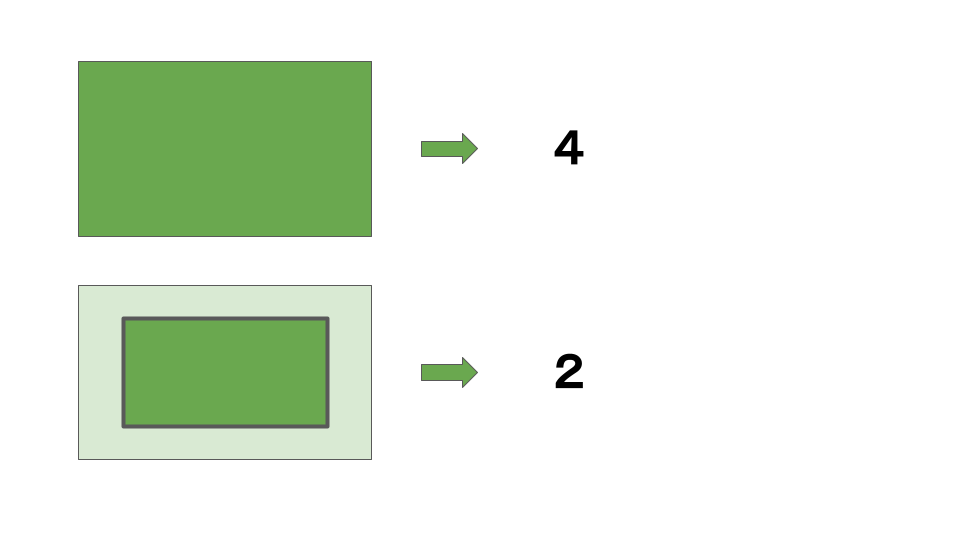
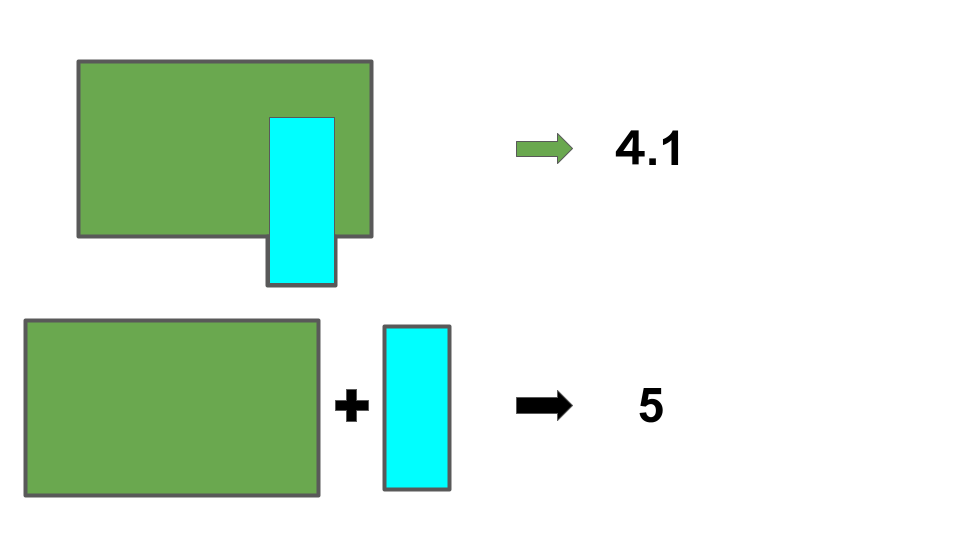

# 俺の測度論の理解

---
# 測度論のイントロダクション
集合に、その様子を要約するような「いい感じの値」を割り当てたいな
割り当てのルールを考えてみよう

---
# 測度論のイントロダクション
とりあえず、空集合∅は0になってほしいな

---
# 測度論のイントロダクション
部分は全体よりも値が小さくなってほしいな

---
# 測度論のイントロダクション
重なってる集合の値は、それぞれの値を足したものよりも小さくなってほしいな

---
# 外測度
ルールをまとめてみるか。

**[Def]**
$X$を一般の集合、$\mathcal{P}(X)$を$X$の部分集合全体からなる集合族とする。
写像$\nu:\mathcal{P}(X) \rightarrow [0,\infty]$は次の性質をもつとする。
1. $\nu(\varnothing)=0$
2. $E \subset F$ならば$\nu(E) \le \nu(F)$
3. $X$の集合列$\{E_j\}_{j=1}^\infty$に対して
$$
\nu\Bigg(\sum^\infty_{j=1}E_j \Bigg) \le \sum^\infty_{j=1}\nu(E_j)
$$

$\nu$を**外測度**と名付けるか。

---
# 外測度
「いい感じのルール」になったかな？
ちょっと、実数全体の集合$\mathbb{R}$上でうまく動くか試してみるか。

\# ここから実数の世界を対象に考える

---
# ルベーグ外測度
TODO:工事中

---
# ルベーグ測度
TODO:工事中

---
# ルベーグ非可測集合
**[Thm]**
ツェルメロの公理を仮定すると、$\mathbb{R}$にはルベーグ非可測集合が存在する。

---
# ルベーグ非可測集合
だめそうだな…

しゃーないから「いい感じのルール」が適用できるやつらだけ集めて、
その中で遊ぶか

\# 実数対象はここまで
\# ここから一般の集合の世界に戻る

---
# 可測集合

**[Def]**
$\nu$を$X$上の外測度とする。$X$の任意の部分集合$A$に対し
$$ \nu(A)=\nu(A \cap E)+\nu(A-E) \qquad \qquad \tag{1}$$
が成立するとき、「$X$の部分集合$E$が$\nu$可測集合である」という。
(1)をカラテオドリの条件という。

---
# 可測集合
$\nu$可測集合ってどんな性質をもつか調べるか。

**[Thm]** カラテオドリの定理
$\nu$を外測度とする。$X$の$\nu$可測集合の全体を$\mathcal{M}$とおく。
このとき、次が成立する。
1. $\mathcal{M}$は完全加法族である。
2. $E\in \mathcal{M}$に対して$\mu(E)=\nu(E)$で$\mu$を定義すれば、$\mu$は$\mathcal{M}$上の完備な測度である。

---
# 可測関数
一般の集合の「いい感じの部分集合」に「いい感じの値」が定められるなら、
一般の集合上の関数に対して、積分を考えられるんじゃね？

---
# ルベーグ積分
TODO:工事中

---
# ルベーグ二乗可積分な関数の集合
TODO:工事中

---
# Appendix
TODO:工事中

---
# 完全加法族
**[Def]** 完全加法族

---
# 測度
**[Def]** 測度

---
# 完備な測度空間
**[Def]** 測度空間

**[Def]** 完備

---
# カラテオドリの定理の証明
**[Prf]**
