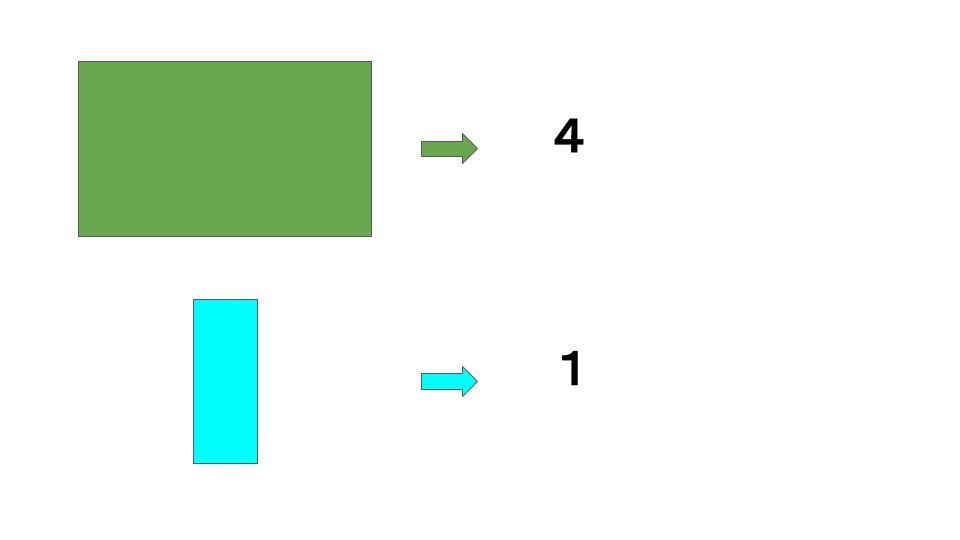

# 私の測度論の理解

測度論：
　集合が与えられたとき、その部分集合の大きさを「どのように測るか」という理論

---
# 測度論のイントロダクション
集合に、その様子を要約するような「いい感じの値」を割り当てたいな
割り当てのルールを考えてみよう

---
# 測度論のイントロダクション
とりあえず、空集合∅は0になってほしいな

---
# 測度論のイントロダクション
部分は全体よりも値が小さくなってほしいな

---
# 測度論のイントロダクション
重なってる集合の値は、それぞれの値を足したものよりも小さくなってほしいな

---
# 外測度
ルールをまとめてみるか。
$X$の部分集合を無限個とりだしてもいいようにルールを取り決めておこう。

**[Def]**
$X$を一般の集合、$\mathcal{P}(X)$を$X$の部分集合全体からなる集合族とする。
写像$\nu:\mathcal{P}(X) \rightarrow [0,\infty]$は次の性質をもつとする。
1. $\nu(\varnothing)=0$
2. $E \subset F$ならば$\nu(E) \le \nu(F)$
3. $X$の集合列$\{E_j\}_{j=1}^\infty$に対して
$$
\nu \left( \sum^\infty_{j=1}E_j \right) \le \sum^\infty_{j=1}\nu(E_j)
$$

$\nu$を**外測度**と名付けるか。

---
# 「外測度」へ至る道の出発点の取り直し（次の準備）
- $\mathcal{E}$を、$\mathcal{E} \ni \varnothing, \mathcal{E} \ni X$の条件を満たす「一般の集合$X$」の集合族とする。
- $\mathcal{E}$上に写像$\rho:\mathcal{E} \rightarrow [0, \infty]$が与えられており、$\rho(\varnothing)=0$とする。
- $X$の任意の部分集合$E$に対し、$S_E$を可算個の$\mathcal{E}$の元$A_k(k=1,2,\cdots)$で、$\bigcup^\infty_{k=1}A_k \supset E$なるものの集まりとし、$\mathcal{S}(E)$を$S_E$の全体とする。

ここで、$X$の任意の部分集合$E$に対し、$\nu(E)$を
$$
\nu(E) = \inf \left\{ \sum^\infty_{k=1}\rho(A_k)|S_E = \{ A_k\}^\infty_{k=1} \in \mathcal{S}(E) \right\}
$$
で定義する。右辺の下限は$S_E=\{A_k\}^\infty_{k=1}\in \mathcal{S}(E)$すべてについてとる。

$\nu$は外測度である。
(証明は省く。ちなみに、外測度の定義3の条件が成り立つのを示すには、$E=\cup^\infty_{j=1}E_j$となるような集合列$E_j$を考え、$E_j$をぎりぎり覆う$A_k$を考えたらよい。)

---
# 外測度
「いい感じのルール」になったかな？
ちょっと、$k$次元ユークリッド空間$\mathbb{R}^k$上でうまく動くか試してみる。

\# ここからユークリッド空間を対象に考える

---
# ユークリッド空間の半開区間
$\mathbb{R}^k$の半開区間$I$を以下で定義する。
$$
\begin{aligned}
I &= [a_1,b_1) \times [a_2,b_2) \times \cdots \times [a_k,b_k) \\
&= \{(x_1,x_2,\cdots,x_k) | a_1 \le x_1 < b_1, a_2 \le x_2 <b_2, \cdots, a_k \le x_k < b_k \}
\end{aligned}
$$

$I$の$k$次元体積を次の$|I|_e$で定義する。
$$
|I|_e = (b_1 -a_1)\times(b_2-a_2)\times\cdots\times(b_k-a_k)
$$

---
# ルベーグ外測度
$\mathbb{R}^k$の部分集合$S$が与えられたとき、$S$を可算個の半開区間でおおう被覆を考える。
$$
S \subset \bigcup^\infty_{n=1}I_n
$$
この被覆をいろいろにとったときの下限として、
$$
\nu(S)=\inf \sum|I_n|_e
$$
とおく。$\nu$を$S$の**ルベーグ外測度**とする。

---
# ルベーグ可測集合
TODO:工事中

---
# ルベーグ非可測集合
**[Thm]**
ツェルメロの公理を仮定すると、$\mathbb{R}$にはルベーグ非可測集合が存在する。

---
# ルベーグ非可測集合
しゃーないから「いい感じのルール」が適用できるやつらだけ集めて、
その中で遊ぶか

\# ユークリッド空間を対象にするのはここまで
\# ここから「一般の集合」の世界に戻る

---
# 可測集合

**[Def]**
$\nu$を$X$上の外測度とする。$X$の任意の部分集合$A$に対し
$$ \nu(A)=\nu(A \cap E)+\nu(A-E) \qquad \qquad \tag{1}$$
が成立するとき、「$X$の部分集合$E$が$\nu$可測集合である」という。
(1)をカラテオドリの条件という。

---
# 可測集合
$\nu$可測集合ってどんな性質をもつか調べるか。

**[Thm]** カラテオドリの定理
$\nu$を外測度とする。$X$の$\nu$可測集合の全体を$\mathcal{M}$とおく。
このとき、次が成立する。
1. $\mathcal{M}$は完全加法族である。
2. $E\in \mathcal{M}$に対して$\mu(E)=\nu(E)$で$\mu$を定義すれば、$\mu$は$\mathcal{M}$上の完備な測度である。

---
# 可測関数
一般の集合の「いい感じの部分集合」に「いい感じの値」が定められるなら、
一般の集合上の関数に対して、積分を考えられるんじゃね？

---
# ルベーグ積分
TODO:工事中

---
# ルベーグ二乗可積分な関数の集合
TODO:工事中

---
# Appendix
TODO:工事中

---
# 完全加法族
**[Def]** 完全加法族

---
# 測度
**[Def]** 測度

---
# 完備な測度空間
**[Def]** 測度空間

**[Def]** 完備

---
# カラテオドリの定理の証明
**[Prf]**
